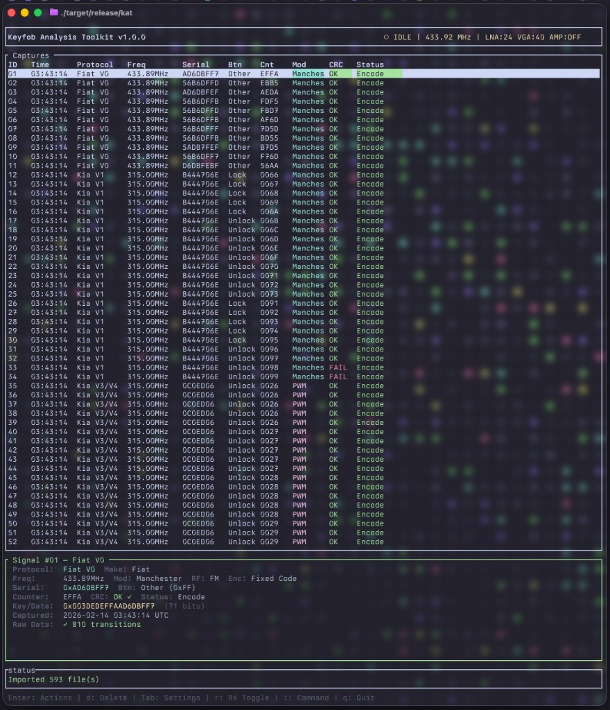

# KAT — Keyfob Analysis Toolkit

A terminal-based RF signal analysis tool for capturing, decoding, and retransmitting automotive keyfob signals. Built in Rust with a real-time TUI powered by `ratatui`. Protocol decoders are aligned with the [ProtoPirate](REFERENCES/ProtoPirate/) reference.

**Supported hardware:** KAT uses **HackRF One** (or compatible) when present for full receive and transmit. For **receive-only** operation, **RTL433** (or any compatible RTL-SDR dongle) is supported: if no HackRF is found, KAT uses the first available RTL-SDR for capture and decode; transmit (Lock/Unlock/Trunk/Panic, Replay) is disabled when using RTL433/RTL-SDR.



---

## Features

- **Real-time capture** — receive and demodulate AM/OOK keyfob signals at configurable frequencies (HackRF uses AM envelope detection; FM protocols are tagged for display and may decode when signal is strong)
- **Multi-protocol decoding** — 14 protocol decoders: Kia V0–V6, Ford V0, Fiat V0, Subaru, Suzuki, VAG (VW/Audi/Seat/Skoda), PSA, Scher-Khan, Star Line; adaptive demodulation for real-world conditions
- **KeeLoq generic fallback** — when a signal doesn’t match any known protocol, KAT tries decoding it as KeeLoq using every manufacturer key in the embedded keystore (Kia V3/V4 and Star Line air formats); successful decodes appear as **Keeloq (keystore name)** in the capture list
- **RF modulation metadata** — each protocol tagged as AM, FM, or both (from ProtoPirate); shown in signal detail and exported in .fob
- **Rich signal detail** — encoding (PWM/Manchester), RF (AM/FM), encryption, serial, counter, key data, CRC, frequency, and raw level/duration pairs
- **Signal retransmission** — transmit Lock, Unlock, Trunk, and Panic commands from decoded captures, or Replay raw capture (HackRF only; when using RTL-SDR these show “(no TX)” and a receive-only message). VAG supports full encode from capture via stored vag_type/key_idx.
- **Export formats** — `.fob` (versioned JSON with vehicle metadata, signal info, optional raw pairs) and `.sub` (Flipper Zero compatible)
- **Import support** — load `.fob` files with automatic v1/v2 format detection
- **Research mode** — config option to show unknown (unidentified) signals in addition to successfully decoded ones
- **INI configuration** — `~/.config/KAT/config.ini` (auto-created with comments on first run): export path, max captures, research_mode, radio defaults, export format
- **Embedded keystore** — manufacturer keys (Kia, VAG, etc.) built in for decoding
- **VIM-style command line** — `:freq`, `:lock`, `:unlock`, `:save`, `:load`, `:delete`, `:q` / `:quit`, and more
- **Interactive TUI** — captures list with detail panel (protocol, freq, mod, RF, encryption), signal action menu, radio settings, fob export form; header shows device (HackRF / RTL-SDR (RX only) / No device) and status (DISCONNECTED in red when no device)

## Requirements

- **Radio hardware (one of):**
  - **HackRF One** (or compatible) — full receive and transmit
  - **RTL433 / RTL-SDR** — receive-only; no transmit (RTL433 dongles and compatible RTL-SDR hardware)
- **Rust 1.75+** (for building from source)
- **libhackrf** — HackRF C library and headers (required at build time even when using RTL-SDR)
- **libusb** — for RTL433/RTL-SDR (usually provided by OS)

At runtime, KAT tries **HackRF first**; if none is found, it uses the first available **RTL433/RTL-SDR** for receive-only. If neither is connected, it runs without TX/RX support (no live capture); a startup warning offers to continue or you can connect a device and restart.

### Installing Dependencies

**macOS:**

```bash
brew install hackrf
# RTL433/RTL-SDR: no extra system lib required; rtl-sdr-rs uses rusb
```

**Debian / Ubuntu:**

```bash
sudo apt install libhackrf-dev pkg-config libusb-1.0-0-dev
```

**Fedora:**

```bash
sudo dnf install hackrf-devel pkg-config libusb1-devel
```

**Arch Linux:**

```bash
sudo pacman -S hackrf libusb
```

On **Linux**, if using RTL433/RTL-SDR, you may need to unload DVB-T kernel modules so the device is not claimed by the kernel (see [rtl-sdr-rs](https://crates.io/crates/rtl-sdr-rs)).

## Building

```bash
git clone <repo-url> && cd KAT
cargo build --release
```

The binary is placed at `target/release/kat`.

## Usage

```bash
./target/release/kat
```

KAT starts in an interactive terminal UI. If no HackRF or RTL433/RTL-SDR is detected, a warning appears (“No HackRF or RTL-SDR detected”) and you can press any key to continue without TX/RX support—you can still view, import, and export captures. The header shows the active device (**HackRF**, **RTL-SDR (RX only)** when using RTL433/RTL-SDR, or **No device**) and radio status; when no device is connected, the status is shown in red (DISCONNECTED). When using RTL433/RTL-SDR, transmit actions (Replay, TX Lock/Unlock/Trunk/Panic) show “(no TX)” in the signal menu and display a receive-only message if selected.

### Keyboard Controls

| Key | Action |
|---|---|
| `j` / `k` or Arrow Up / Down | Navigate captures list |
| `Enter` | Open signal action menu on selected capture |
| `Tab` | Open radio settings menu (Frequency, LNA, VGA, AMP) |
| `r` | Toggle receive mode (start/stop RX) |
| `:` | Enter VIM-style command mode |
| `Esc` | Close menu / cancel current action |
| `q` | Quit (restores terminal) |
| `:q` or `:quit` | Quit from command line (same as `q`; restores terminal) |

### Signal Action Menu

Press `Enter` on a capture to open the action menu. When using RTL-SDR (receive-only), transmit actions show **(no TX)** and are disabled.

| Action | Description |
|---|---|
| Replay | Re-transmit raw capture (HackRF only; “no TX” with RTL-SDR) |
| TX Lock | Transmit lock command |
| TX Unlock | Transmit unlock command |
| TX Trunk | Transmit trunk release command |
| TX Panic | Transmit panic alarm command |
| Export .fob | Export signal with full vehicle + signal metadata |
| Export .sub | Export in Flipper Zero SubGHz format |
| Delete | Remove capture from the list |

### Fob Export

When exporting to `.fob`, a metadata form collects filename and optional vehicle info:

- **File** — output filename (extension added by format)
- **Year** — vehicle model year
- **Make** — manufacturer (auto-suggested from protocol)
- **Model** — vehicle model
- **Region** — region/market
- **Notes** — free-form notes

The exported `.fob` file is a versioned JSON document (v2.0, format `kat-fob`) containing:

```json
{
  "version": "2.0",
  "format": "kat-fob",
  "signal": {
    "protocol": "Kia V3/V4",
    "frequency": 433920000,
    "frequency_mhz": "433.92MHz",
    "modulation": "PWM",
    "rf_modulation": "AM/FM",
    "encryption": "KeeLoq",
    "data_bits": 64,
    "data_hex": "...",
    "serial": "0x1A2B3C",
    "key": "0x...",
    "button": 1,
    "button_name": "Lock",
    "counter": 1234,
    "crc_valid": true,
    "encoder_capable": true
  },
  "vehicle": {
    "year": 2023,
    "make": "Kia",
    "model": "Sportage",
    "region": "",
    "notes": ""
  },
  "capture": {
    "timestamp": "2026-02-07T12:00:00Z",
    "raw_pairs": [{"level": true, "duration_us": 400}, {"level": false, "duration_us": 800}]
  }
}
```

`rf_modulation` is AM, FM, or AM/FM per protocol (from ProtoPirate). Raw pairs are included when config `include_raw_pairs` is true.

### VIM-Style Commands

Transmit commands (`:lock`, `:unlock`, `:trunk`, `:panic`) require HackRF; with RTL-SDR they report that transmit is not available.

| Command | Description |
|---|---|
| `:freq <MHz>` | Set receive frequency (e.g. `:freq 433.92`) |
| `:lock <ID>` | Transmit lock signal for capture ID |
| `:unlock <ID>` | Transmit unlock signal for capture ID |
| `:trunk <ID>` | Transmit trunk release signal |
| `:panic <ID>` | Transmit panic alarm signal |
| `:save <ID>` | Save capture to file |
| `:delete <ID>` | Delete capture from list |
| `:load <file>` | Import capture from `.fob` or `.sub` file |
| `:q` or `:quit` | Quit application (terminal restored cleanly, same as pressing `q`) |

## Configuration

On first launch, KAT creates the config directory and a default config file. Captures are **in-memory only** and are not written to disk unless you export them.

```
~/.config/KAT/
├── config.ini      # Application settings (auto-generated with comments)
└── exports/        # Default export directory for .fob / .sub files
```

Example `config.ini` (all keys optional; defaults are used if missing):

```ini
[general]
export_directory = ~/.config/KAT/exports
import_directory = ~/.config/KAT/import
max_captures = 100
research_mode = false

[radio]
default_frequency = 433920000
default_lna_gain = 24
default_vga_gain = 20
default_amp = false

[export]
default_format = fob
include_raw_pairs = true
```

- **import_directory** — directory scanned at startup for .fob and .sub files to import (default `~/.config/KAT/import`). Exports are still saved to **export_directory**.
- **research_mode** — when `false` (default), only successfully decoded signals appear in the list; when `true`, unknown (unidentified) signals are also shown.
- **include_raw_pairs** — when `true`, .fob exports include raw level/duration pairs for replay.

## Supported Protocols

Protocol behavior and RF modulation (AM/FM) follow the ProtoPirate reference. KAT’s receiver is AM/OOK only; FM protocols may still decode when the signal produces a usable envelope.

| Protocol | Encoding | RF | Encryption | Frequency |
|---|---|---|---|---|
| Kia V0 | PWM | FM | Fixed Code | 433.92 MHz |
| Kia V1 | Manchester | AM | Fixed Code | 315 / 433.92 MHz |
| Kia V2 | Manchester | FM | Fixed Code | 315 / 433.92 MHz |
| Kia V3/V4 | PWM | AM/FM | KeeLoq | 315 / 433.92 MHz |
| Kia V5 | Manchester | FM | Fixed Code | 433.92 MHz |
| Kia V6 | Manchester | FM | Fixed Code | 433.92 MHz |
| Ford V0 | Manchester | FM | Fixed Code | 433.92 MHz |
| Fiat V0 | Manchester | FM | Fixed Code | 433.92 MHz |
| Subaru | PWM | AM | Rolling Code | 433.92 MHz |
| Suzuki | PWM | AM | Rolling Code | 433.92 MHz |
| VAG (VW/Audi/Seat/Skoda) | Manchester | AM | AUT64/XTEA | 433.92 / 434.42 MHz (decode + encode) |
| Scher-Khan | PWM | FM | Magic Code | 433.92 MHz |
| Star Line | PWM | AM | KeeLoq | 433.92 MHz |
| PSA (Peugeot/Citroën) | Manchester | FM | XTEA/XOR | 433.92 MHz |

**KeeLoq generic fallback:** If no protocol decodes a capture, KAT tries KeeLoq with every keystore manufacturer key (Kia V3/V4 and Star Line bit layouts). On success the protocol is shown as **Keeloq (*keystore name*)** (e.g. Keeloq (Alligator), Keeloq (Pandora_PRO)). See [docs/keeloq_generic.md](docs/keeloq_generic.md).

### Cryptographic modules

- **KeeLoq** — encrypt/decrypt with normal, secure, FAAC, and magic serial/XOR learning key derivation (keeloq_common, keys). Unknown signals are tried as KeeLoq with every keystore key via **keeloq_generic** (uses keeloq_common only).
- **AUT64** — 12-round block cipher for VAG type 1/3/4 (aut64)
- **Keystore** — manufacturer keys (Kia, VAG, etc.) built in; see `src/keystore/`

### Demodulator

The **AM/OOK** demodulator turns IQ samples into level/duration pairs for protocol decoders. FM/2FSK is not demodulated; protocols are tagged AM/FM for display and export.

- **Envelope detection** — magnitude from I/Q for AM
- **Adaptive threshold** — transition-based updates to handle varying signal levels
- **Exponential moving average** — magnitude smoothing
- **Schmitt trigger hysteresis** — reduces chattering at the decision boundary
- **Debounce** — 40µs minimum pulse width to reject noise spikes
- **Gap detection** — 20 ms gap treated as end of signal

## IMPORTS folder

The `IMPORTS/` directory holds sample `.sub` captures by manufacturer for testing. If you see `desktop.ini` files in subfolders (e.g. from Windows), you can delete them; they are ignored by git (see `.gitignore`).

## Project Structure

```
src/
├── main.rs              # Entry point, event loop, key handling
├── app.rs               # Application state, radio events, signal actions
├── capture.rs           # Capture data (data_extra for protocol encode state), encoding/RF modulation
├── storage.rs           # Config (INI), export dir, resolve_config_dir, Storage
├── keystore/
│   ├── mod.rs           # Keystore trait and access
│   └── embedded.rs      # Embedded manufacturer keys (Kia, VAG, etc.)
├── export/
│   ├── fob.rs           # .fob JSON export/import (v1 + v2, rf_modulation)
│   └── flipper.rs      # Flipper Zero .sub export
├── protocols/
│   ├── mod.rs           # Protocol registry, decoder trait, duration_diff macro
│   ├── common.rs        # DecodedSignal (extra for VAG encode), CRC, bit helpers, button codes
│   ├── keeloq_common.rs # KeeLoq cipher + learning key algorithms (used by Kia V3/V4, Star Line, keeloq_generic)
│   ├── keeloq_generic.rs # KeeLoq fallback: try every keystore key when no protocol matches (uses keeloq_common)
│   ├── aut64.rs         # AUT64 block cipher (VAG)
│   ├── keys.rs          # Key loading (embedded + optional file), KIA/VAG
│   ├── kia_v0..kia_v6.rs
│   ├── ford_v0.rs, fiat_v0.rs, subaru.rs, suzuki.rs
│   ├── vag.rs           # VAG decoder/encoder (4 sub-types; encode from capture via extra)
│   ├── scher_khan.rs, star_line.rs, psa.rs
│   └── ...
├── radio/
│   ├── hackrf.rs        # HackRF device control (RX/TX)
│   ├── rtlsdr.rs        # RTL-SDR device control (RX only)
│   ├── demodulator.rs   # AM/OOK demodulator (IQ -> level/duration)
│   └── modulator.rs    # Level/duration -> TX waveform
└── ui/
    ├── layout.rs        # TUI layout, fob metadata form
    ├── captures_list.rs # Captures table + detail (protocol, mod, RF, enc)
    ├── signal_menu.rs   # Signal action menu
    ├── settings_menu.rs # Radio settings (Freq, LNA, VGA, AMP)
    ├── command.rs       # VIM-style command line
    └── status_bar.rs    # Status bar
```

## Credits

KAT is developed by **Kara Zajac (.leviathan)**. KAT would not be possible without [ProtoPirate](https://protopirate.net/ProtoPirate/ProtoPirate)—the protocol decoders, reference implementations, and community work are the foundation this tool is built on. Truly standing on the shoulders of giants.

### ProtoPirate Development Team

RocketGod, MMX, Leeroy, gullradriel, Skorp (thanks for the Weather App inspiration!), Vadim's Radio Driver.

### Protocol Magic

L0rdDiakon, YougZ, RocketGod, MMX, DoobTheGoober, Skorp, Slackware, Trikk, Wootini, Li0ard, Leeroy.

### Reverse Engineering Support

DoobTheGoober, MMX, NeedNotApply, RocketGod, Slackware, Trikk, Li0ard.

---

## License

[BSD-3-Clause NO MILITARY NO GOVERNMENT](LICENSE)
